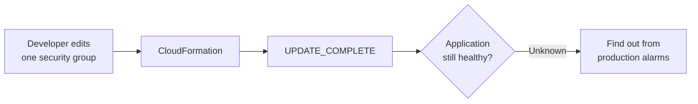
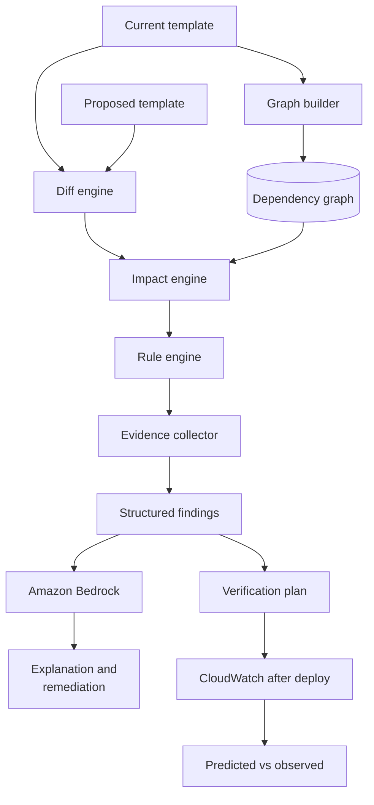
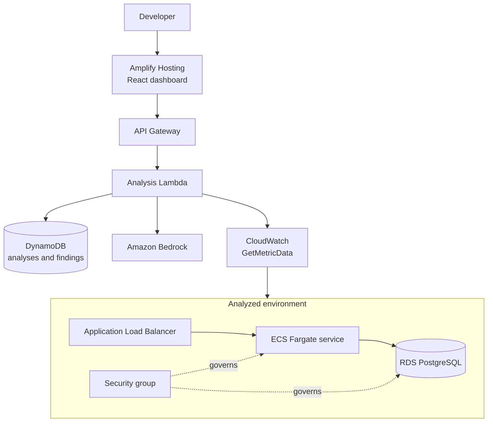
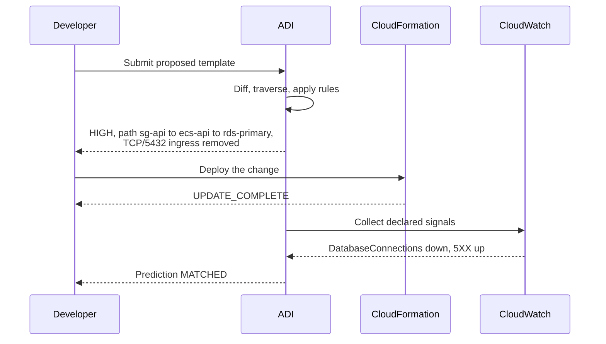

# AWS Deployment Intelligence (ADI)

A dependency-aware change impact engine for AWS infrastructure.

ADI answers one question that existing deployment tooling does not: **if I deploy this change, what else can it break?**

CloudFormation reports `UPDATE_COMPLETE`. A change set lists the resources CloudFormation will touch. Neither tells you that removing TCP/5432 from one security group will take the application database offline. ADI builds a dependency graph of the stack, diffs the proposed template against the current one, propagates the change through the graph, and reports the affected resources with the evidence supporting each conclusion. After the change is deployed, it compares the predicted impact against real CloudWatch telemetry.

**Event:** WeMakeDevs x AWS First Commit, 17 to 20 September 2026
**Track:** Ship It
**Repository initialized:** 17 September 2026, at the start of the build window

---

## 1. Problem

A deployment that succeeds is not the same as an application that works.



A CloudFormation change set for that edit lists exactly one modified resource. It says nothing about the ECS service that uses the security group, or the RDS instance the service connects to through it. The dependency information exists in the template, but nothing traverses it on the developer's behalf.

## 2. What ADI does



The pipeline is deterministic up to the Bedrock step. Rules, graph traversal and evidence collection produce the findings. Bedrock explains findings that already exist. If Bedrock is unavailable, the analysis still completes without the narrative layer.

## 3. Scope

This section is the contract. Anything not listed under **In scope** is not built.

### 3.1 In scope

| Capability | Definition of done |
|---|---|
| Template diff | Parse two CloudFormation templates, classify every resource change as CREATE, UPDATE, DELETE or REPLACE, and produce a typed change set. |
| Dependency graph | Build nodes and edges from `Ref`, `Fn::GetAtt`, `Fn::Sub` and `DependsOn`. A graph can be built with no live account access. |
| Impact traversal | From each changed resource, walk dependents breadth first and classify each reachable resource as directly or indirectly affected. |
| Rule engine | Six deterministic rules covering the cases in section 4. Each rule emits a finding with severity, causal path, evidence list and verification signals. |
| Evidence | Every finding carries the facts it was derived from, each attributed to its source (template, diff or graph). No finding without evidence. |
| Bedrock explanation | One Bedrock invocation per analysis, over the compressed finding set. Grounded prompt, JSON response, sanitized input. |
| Verification | For the primary scenario, collect the declared CloudWatch signals before and after deployment and report `MATCHED`, `UNCONFIRMED` or `CONTRADICTED`. |
| Web dashboard | Three views: graph, findings, verification. Deployed on Amplify Hosting with a public URL. |
| Demo environment | One live ALB to ECS to RDS stack in a single region, deployed once and kept stable. |

### 3.2 Explicitly out of scope

Recorded here so they are not reintroduced mid build.

- CLI. The dashboard is the only frontend.
- Authentication. No Cognito, no user accounts.
- Step Functions and EventBridge orchestration. Analysis runs in a single Lambda.
- CloudTrail integration.
- Live account discovery through SDK `Describe` calls. The template is the source of truth for the graph. This may be layered on afterwards only if section 8 finishes early.
- Terraform, CDK, Pulumi and SAM input formats.
- Any AWS service outside the six in section 4.
- Machine learning, risk percentages and numeric failure probabilities.
- Automated remediation, or any write operation against analyzed infrastructure.
- Multi-region and multi-account analysis.
- Cost analysis.

### 3.3 Non-negotiable constraints

1. ADI performs no write operations against analyzed infrastructure. The analyzer IAM role is read only.
2. No finding is ever hardcoded, stubbed or faked for the demo. Every value shown in the dashboard is produced by the pipeline from real input.
3. Bedrock is never the source of truth. It receives findings and returns prose.
4. Credentials never reach the frontend.

## 4. Covered services and rules

Six services, six rules. Depth over breadth.

| Rule ID | Trigger | Severity | Verification signals |
|---|---|---|---|
| `NET-SG-001` | Security group ingress permission removed or narrowed | HIGH when a consumer in the source group depends on the protected resource, MEDIUM otherwise | RDS `DatabaseConnections` falls, target `HTTPCode_Target_5XX_Count` rises |
| `IAM-POL-001` | Permission or managed policy removed from a role that a resource assumes | HIGH | `HealthyHostCount` falls for ECS execution roles, `AccessDenied` in logs for task roles, `Errors` for Lambda |
| `ALB-HC-001` | Target group health check setting changed | HIGH when the targets' security group blocks the new health check port, MEDIUM otherwise | `UnHealthyHostCount` rises, `HealthyHostCount` falls |
| `ECS-RES-001` | Task or container CPU or memory reduced | MEDIUM | ECS `MemoryUtilization` or `CPUUtilization` rises |
| `RDS-REP-001` | DB instance change that requires replacement | CRITICAL | RDS `DatabaseConnections` falls, target `HTTPCode_Target_5XX_Count` rises |
| `DEP-ORPH-001` | Resource deleted while surviving resources depend on it, or leaving a target group with no listener | HIGH | Target group `RequestCount` falls, or failure signals of the dependents |

Each rule cites the AWS documentation behind any behavior it relies on. Three findings in particular depend on AWS behavior that is easy to miss, and the signals above reflect it:

- Security groups do not interrupt tracked connections when a rule changes, so a network change surfaces as connections are recycled, not at `UPDATE_COMPLETE`.
- An ECS execution role is used when a task launches. Removing a permission from it breaks nothing that is already running.
- An Application Load Balancer fails open when every target is unhealthy, so target health is the reliable signal for a health check change, not client errors.

Adding a seventh rule is scope expansion and follows the process in `AGENTS.md`.

## 5. Architecture



| AWS service | Role in ADI |
|---|---|
| Amplify Hosting | Serves the dashboard and provides the public submission URL |
| API Gateway | HTTP entry point for the analysis and verification endpoints |
| Lambda | Runs the analysis pipeline and the verification pass |
| DynamoDB | Stores analyses, findings and verification results |
| Amazon Bedrock | Generates explanations from structured findings |
| CloudWatch | Supplies the observed telemetry for verification |
| CloudFormation | Both the analyzed input and the deployment mechanism for the demo stack |
| IAM | Read only analyzer role, least privilege |

### 5.1 Technology

| Layer | Choice | Reason |
|---|---|---|
| Engine and Lambda handlers | TypeScript on Node 22 (Lambda `nodejs22.x`), AWS SDK v3 | CloudFormation templates are deeply nested untyped structures with intrinsic functions. TypeScript models them directly, and the domain types are shared with the frontend rather than duplicated across a language boundary. |
| Dashboard | React with Vite, React Flow with a dagre layout | Three screens, no routing framework required. React Flow gives a readable causal path view without building a layout engine. |
| ADI platform stack | AWS SAM | Purpose built for Lambda and API Gateway, and `sam deploy` iterates fast during the build window. |
| Demo stack | Plain CloudFormation, no transform | The demo template is the literal input ADI analyzes. It must be ordinary CloudFormation so the before and after pair stays clean. |
| Tests | Vitest | Shares configuration with Vite, so ESM and TypeScript need no additional setup. One runner for engine and dashboard tests. |
| Packages | npm workspaces | Single repository, no install step for a contributor to debug. |

The stack is fixed for the build window. Changing it mid build is a scope change and follows the process in `AGENTS.md`.

## 6. Primary demonstration

The single scenario the project is built to prove end to end.



The contrast that carries the demonstration: the CloudFormation change set for this edit reports one modified resource and no warnings. ADI reports the path to the database and names the signals to watch, before the deployment happens.

A second scenario is included where prediction and observation do not agree, and ADI reports `UNCONFIRMED`. A tool that can report a missed prediction is more credible than one that is always right.

## 7. Repository layout

Two npm workspaces, `engine` and `web`.

```
.
├── engine/                       Analysis engine and Lambda handlers
│   └── src/
│       ├── types/                Shared domain types, imported by web
│       ├── core/                 Deterministic engine. No AWS SDK imports.
│       │   ├── graph/            Reference extraction, graph construction, queries
│       │   ├── diff/             Template comparison and change classification
│       │   ├── impact/           Change propagation through the graph
│       │   ├── rules/            One file per rule, plus the registry
│       │   └── evidence/         Fact collection and source attribution
│       ├── aws/                  Everything that talks to AWS
│       │   ├── cloudformation/   Template parsing, short form intrinsic expansion
│       │   ├── cloudwatch/       Signal collection for verification
│       │   ├── bedrock/          Client, grounded prompt, input sanitization
│       │   └── dynamodb/         Persistence for analyses and findings
│       └── api/
│           └── handlers/         One handler per endpoint
├── web/                          React dashboard
│   └── src/
│       ├── views/                Graph, findings, verification
│       ├── components/           Custom nodes, causal path, evidence, badges
│       ├── api/                  Typed client against the API contracts
│       └── lib/                  Dagre layout for React Flow
├── infrastructure/
│   ├── platform/                 The ADI stack. AWS SAM template.
│   ├── demo/                     The ALB to ECS to RDS stack. Plain CloudFormation.
│   └── policies/                 Analyzer read only IAM policy
├── scenarios/                    One directory per rule
│   └── NN-name/                  after.yaml and expected.json; the demo baseline is the before state
├── tests/
│   ├── unit/                     Graph, diff, impact, one file per rule
│   ├── scenarios/                End to end runs asserting expected findings
│   └── fixtures/                 Captured AWS responses
└── docs/
    ├── decisions/                One file per decision worth recording
    ├── demo-script.md            The exact sequence recorded for the video
    └── deferred.md               Out of scope ideas, captured and not built
```

Two boundaries matter and are enforced in review:

1. `engine/src/core` must not import the AWS SDK. It operates on normalized domain objects supplied by `engine/src/aws`. This is what lets the entire engine be tested without an AWS account, and it keeps the scenario suite fast and deterministic.
2. `engine/src/types` is the only module `web` imports from `engine`. Domain types are shared, not duplicated.

Every rule in section 4 has exactly one directory in `scenarios/` and one test file in `tests/unit/rules/`. A rule without both is not finished.

## 8. Build plan

The window is 17 to 20 September 2026. Submission closes on 20 September, so usable build time is roughly two and a half days.

| Day | Objective | Must be true at end of day |
|---|---|---|
| 17 Sep | Foundation | Demo stack deployed and healthy. Template parser and graph builder pass unit tests against the demo template. |
| 18 Sep | Analysis | Diff engine, impact traversal and all six rules produce correct findings against the fixture scenarios. |
| 19 Sep | Intelligence and UI | Bedrock explanation grounded and returning valid JSON. Verification pass reading real CloudWatch data. Dashboard rendering graph, findings and verification. |
| 20 Sep | Ship | Code frozen by midday. Deployed URL live. Demo video recorded. Blog post published. Submission filed. |

If a day ends without its condition met, the next day's optional work is cut rather than the day's objective deferred.

## 9. What this project is not

- Not an AWS replacement and not a general observability platform.
- Not an autonomous agent. ADI analyzes, explains and recommends. A human decides.
- Not a security scanner and not a cost optimizer.
- Not a claim of predictive accuracy. ADI reports what a change reaches through the graph and whether the declared signals moved. It does not claim to know that a deployment will fail.

## 10. Contributing

Read `AGENTS.md` before making any change. It defines the engineering standards, the verification required before every commit, and the process for anything that touches scope.
