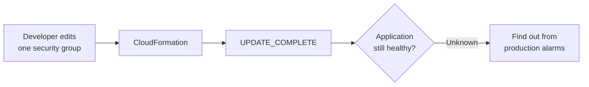
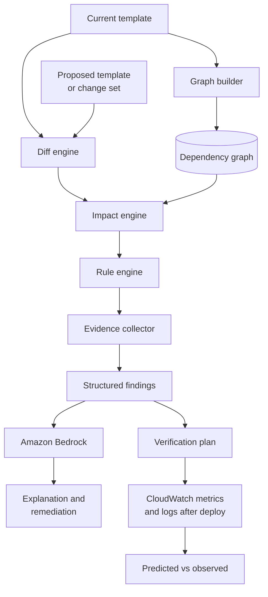
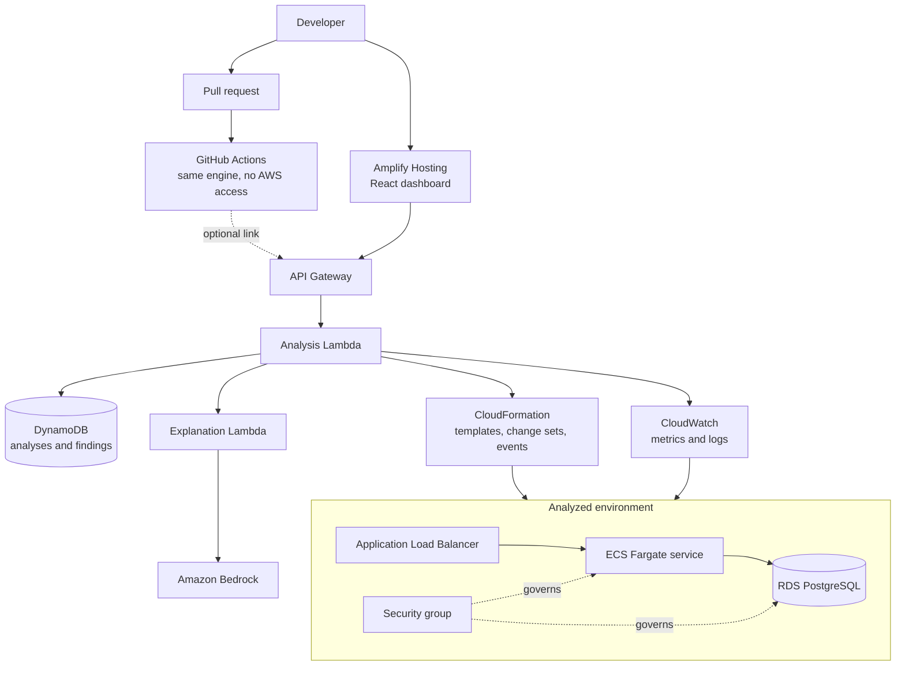
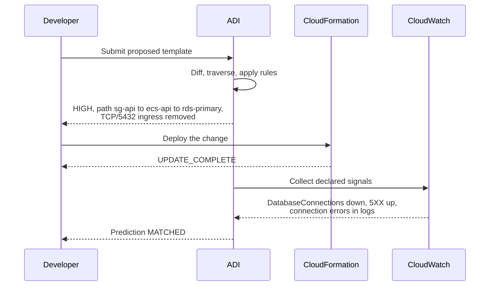

# AWS Deployment Intelligence (ADI)

A dependency-aware change impact engine for AWS infrastructure.

ADI answers one question that existing deployment tooling does not: **if I deploy this change, what else can it break?**

CloudFormation reports `UPDATE_COMPLETE`. A change set lists the resources CloudFormation will touch. Neither tells you that removing TCP/5432 from one security group will take the application database offline. ADI builds a dependency graph of the stack, diffs the proposed template against the current one, propagates the change through the graph, and reports the affected resources with the evidence supporting each conclusion. After the change is deployed, it compares the predicted impact against real CloudWatch telemetry.

**Event:** WeMakeDevs x AWS First Commit, 17 to 20 September 2026
**Track:** Ship It
**Repository initialized:** 17 September 2026, at the start of the build window

---

## 1. Problem

A deployment that succeeds is not the same as an application that works.



A CloudFormation change set for that edit lists exactly one modified resource. It says nothing about the ECS service that uses the security group, or the RDS instance the service connects to through it. The dependency information exists in the template, but nothing traverses it on the developer's behalf.

## 2. What ADI does



The pipeline is deterministic up to the Bedrock step. Rules, graph traversal and evidence collection produce the findings. Bedrock explains findings that already exist. If Bedrock is unavailable, the analysis still completes without the narrative layer.

## 3. Scope

This section is the contract. Anything not listed under **In scope** is not built.

### 3.1 In scope

| Capability | Definition of done |
|---|---|
| Template diff | Parse two CloudFormation templates, classify every resource change as CREATE, UPDATE, DELETE or REPLACE, and produce a typed change set. |
| Dependency graph | Build nodes and edges from `Ref`, `Fn::GetAtt`, `Fn::Sub` and `DependsOn`. A graph can be built with no live account access. |
| Impact traversal | From each changed resource, walk dependents breadth first and classify each reachable resource as directly or indirectly affected. |
| Rule engine | Six deterministic rules covering the cases in section 4. Each rule emits a finding with severity, causal path, evidence list and verification signals. |
| Evidence | Every finding carries the facts it was derived from, each attributed to its source (template, diff or graph). No finding without evidence. |
| Bedrock explanation | One Bedrock invocation per analysis, over the compressed finding set. Grounded prompt, JSON response, sanitized input. |
| Verification | For the primary scenario, collect the declared CloudWatch signals before and after deployment and report `MATCHED`, `UNCONFIRMED` or `CONTRADICTED`. Signals are metrics, or log patterns counted per minute in a log group the stack creates. |
| Web dashboard | Three views: graph, findings, verification. Deployed on Amplify Hosting with a public URL. |
| Change set input | Analyze a CloudFormation change set already created on the stack: the proposed template comes from the change set, and CloudFormation's `Replacement: True` or `False` for each modified resource replaces the documented replacement table. `Conditional` leaves the table's answer. Reading never executes the change set. Added after the core build plan was complete. |
| Pull request review | A GitHub Actions workflow analyzes every CloudFormation template a pull request adds or modifies, comments with the findings, and fails the check at a configurable severity. Added after the core build plan was complete. |
| Demo environment | One live ALB to ECS to RDS stack in a single region, deployed once and kept stable. |

### 3.2 Explicitly out of scope

Recorded here so they are not reintroduced mid build.

- CLI. The dashboard is the only interactive frontend. The pull request review runs as a CI step and is not a general purpose CLI.
- Authentication. No Cognito, no user accounts.
- Step Functions and EventBridge orchestration. Analysis runs in a single Lambda.
- CloudTrail integration.
- Live account discovery through SDK `Describe` calls. The template is the source of truth for the graph. This may be layered on afterwards only if the build plan in section 10 finishes early.
- Terraform, CDK, Pulumi and SAM input formats.
- Any AWS service outside the six in section 4.
- Machine learning, risk percentages and numeric failure probabilities.
- Automated remediation, or any write operation against analyzed infrastructure.
- Multi-region and multi-account analysis.
- Cost analysis.

### 3.3 Non-negotiable constraints

1. ADI performs no write operations against analyzed infrastructure. The analyzer IAM role is read only.
2. No finding is ever hardcoded, stubbed or faked for the demo. Every value shown in the dashboard is produced by the pipeline from real input.
3. Bedrock is never the source of truth. It receives findings and returns prose.
4. Credentials never reach the frontend.

## 4. Covered services and rules

Six services, six rules. Depth over breadth.

| Rule ID | Trigger | Severity | Verification signals |
|---|---|---|---|
| `NET-SG-001` | Security group ingress permission removed or narrowed | HIGH when a consumer in the source group depends on the protected resource, MEDIUM otherwise | RDS `DatabaseConnections` falls, target `HTTPCode_Target_5XX_Count` rises, connection errors appear in the consumer's container logs |
| `IAM-POL-001` | Permission or managed policy removed from a role that a resource assumes | HIGH | `HealthyHostCount` falls for ECS execution roles, `AccessDenied` in logs for task roles, `Errors` for Lambda |
| `ALB-HC-001` | Target group health check setting changed | HIGH when the targets' security group blocks the new health check port, MEDIUM otherwise | `UnHealthyHostCount` rises, `HealthyHostCount` falls |
| `ECS-RES-001` | Task or container CPU or memory reduced | MEDIUM | ECS `MemoryUtilization` or `CPUUtilization` rises |
| `RDS-REP-001` | DB instance change that requires replacement | CRITICAL | RDS `DatabaseConnections` falls, target `HTTPCode_Target_5XX_Count` rises |
| `DEP-ORPH-001` | Resource deleted while surviving resources depend on it, or leaving a target group with no listener | HIGH | Target group `RequestCount` falls, or failure signals of the dependents |

Each rule cites the AWS documentation behind any behavior it relies on. Three findings in particular depend on AWS behavior that is easy to miss, and the signals above reflect it:

- Security groups do not interrupt tracked connections when a rule changes, so a network change surfaces as connections are recycled, not at `UPDATE_COMPLETE`.
- An ECS execution role is used when a task launches. Removing a permission from it breaks nothing that is already running.
- An Application Load Balancer fails open when every target is unhealthy, so target health is the reliable signal for a health check change, not client errors.

Adding a seventh rule is scope expansion and follows the process in `AGENTS.md`.

## 5. Architecture



| AWS service | Role in ADI |
|---|---|
| Amplify Hosting | Serves the dashboard and provides the public submission URL |
| API Gateway | HTTP entry point for the analysis and verification endpoints |
| Lambda | Runs the analysis pipeline and the verification pass, and a second function for explanations |
| DynamoDB | Stores analyses, findings and verification results |
| Amazon Bedrock | Generates explanations from structured findings |
| CloudWatch | Supplies the observed telemetry for verification: metrics, and matching lines in the stack's log groups |
| CloudFormation | The analyzed input, as templates or change sets, and the deployment mechanism for the demo stack |
| IAM | Read only analyzer role, least privilege |

### 5.1 Technology

| Layer | Choice | Reason |
|---|---|---|
| Engine and Lambda handlers | TypeScript on Node 22 (Lambda `nodejs22.x`), AWS SDK v3 | CloudFormation templates are deeply nested untyped structures with intrinsic functions. TypeScript models them directly, and the domain types are shared with the frontend rather than duplicated across a language boundary. |
| Dashboard | React with Vite, React Flow with a dagre layout, Phosphor icons, Plus Jakarta Sans and JetBrains Mono (self hosted) | A few hash routed screens, no routing framework required. React Flow gives a readable causal path view without building a layout engine. |
| ADI platform stack | AWS SAM | Purpose built for Lambda and API Gateway, and `sam deploy` iterates fast during the build window. |
| Demo stack | Plain CloudFormation, no transform | The demo template is the literal input ADI analyzes. It must be ordinary CloudFormation so the before and after pair stays clean. |
| Tests | Vitest | Shares configuration with Vite, so ESM and TypeScript need no additional setup. One runner for engine and dashboard tests. |
| Packages | npm workspaces | Single repository, no install step for a contributor to debug. |
| Pull request review | GitHub Actions running the engine directly with Node's TypeScript support | The same deterministic engine reviews pull requests with no AWS credentials and no build step. |

The stack is fixed for the build window. Changing it mid build is a scope change and follows the process in `AGENTS.md`.

### 5.2 API

| Route | Purpose |
|---|---|
| `POST /analyses` | Analyze a proposed template against a deployed stack (`stackName`) or a supplied `currentTemplate`, or read both from a change set already created on the stack (`stackName` and `changeSetName`). Returns the deterministic analysis immediately. |
| `GET /analyses` | List recent analyses with their change count, finding count, highest severity and verification status. |
| `GET /analyses/{analysisId}` | Read one analysis, including the explanation once it is ready. |
| `POST /analyses/{analysisId}/verification` | Measure the first stack update after the analysis and compare each finding's signals before and after it. |

The explanation is generated by a second function invoked asynchronously, because model latency can exceed the API Gateway integration timeout. The dashboard polls until it is ready or has failed; either way the findings are already complete.

## 6. Primary demonstration

The single scenario the project is built to prove end to end.



The contrast that carries the demonstration: the CloudFormation change set for this edit lists the security group and four resources that reference it, every one as an in place modification with no warning. ADI reports the path to the database and names the signals to watch, before the deployment happens.

This scenario has been run end to end against the live stack, from the change set through to verification: `DatabaseConnections` fell from 2 to 0, target 5XX responses rose from 0 to about 233 a minute, and connection errors in the application's logs rose from 0 to about 254 a minute. Status `MATCHED`.

Verification reports `UNCONFIRMED` whenever a predicted signal stays flat, rather than reading silence as confirmation. Scenario 04 is a caution in the other direction: it was expected to come out unconfirmed, and verified live as `MATCHED`, because peak memory utilization did rise against the halved allocation, from 2.7% to 3.7%. A match confirms that the predicted signal moved, not that the change is dangerous, which is why the finding stays MEDIUM and states only the reduction.

## 7. Repository layout

Two npm workspaces, `engine` and `web`.

```
.
├── engine/                       Analysis engine and Lambda handlers
│   ├── src/
│   │   ├── types/                Shared domain types, imported by web
│   │   ├── core/                 Deterministic engine. No AWS SDK imports.
│   │   │   ├── graph/            Reference extraction, graph construction, queries
│   │   │   ├── diff/             Template comparison and change classification
│   │   │   ├── impact/           Change propagation through the graph
│   │   │   ├── rules/            One file per rule, plus the registry and shared helpers
│   │   │   ├── evidence/         Evidence formatting and source attribution
│   │   │   └── verification/     Signal movement, finding status, deployment windows
│   │   ├── aws/                  Everything that talks to AWS
│   │   │   ├── cloudformation/   Template parsing, deployed template, stack events
│   │   │   ├── cloudwatch/       Signal collection for verification
│   │   │   ├── bedrock/          Grounded prompt, input redaction, response validation
│   │   │   └── dynamodb/         Persistence for analyses
│   │   ├── api/                  Router, service operations and the two Lambda handlers
│   │   ├── report/               Markdown reports for the dashboard and pull requests
│   │   └── review/               Finds and analyzes the templates a pull request changes
│   └── scripts/                  Handler bundling, the local API server, the pull request review
├── web/                          React dashboard
│   └── src/
│       ├── views/                New analysis, analysis, history, rules
│       ├── components/           Impact graph, routed edges, findings, changes, verification
│       ├── api/                  Typed client against the API contract
│       └── lib/                  Graph layout, bundled examples, formatting
├── infrastructure/
│   ├── platform/                 The ADI stack (AWS SAM) and the dashboard deploy script
│   └── demo/                     The ALB to ECS to RDS stack and its traffic generator
├── examples/pull-request-review/ An application stack to open demonstration pull requests against
├── scenarios/                    One directory per rule
│   └── NN-name/                  after.yaml and expected.json; the demo baseline is the before state
├── tests/
│   ├── unit/                     Engine, rules, verification, AWS adapters, service and router
│   └── scenarios/                End to end runs asserting exact expected findings
├── docs/
│   ├── decisions/                One file per decision worth recording
│   ├── aws-setup.md              From an empty AWS account to a deployed platform
│   ├── demo-script.md            The exact sequence recorded for the video
│   └── deferred.md               Out of scope ideas, captured and not built
└── .github/workflows/            CI, template validation, and the pull request review
```

Two boundaries matter and are enforced in review:

1. `engine/src/core` must not import the AWS SDK. It operates on normalized domain objects supplied by `engine/src/aws`. This is what lets the entire engine be tested without an AWS account, and it keeps the scenario suite fast and deterministic.
2. `engine/src/types` is the only module `web` imports from `engine`. Domain types are shared, not duplicated.

Every rule in section 4 has exactly one directory in `scenarios/` and one test file in `tests/unit/rules/`. A rule without both is not finished.

## 8. Running locally

Requires Node.js 22.18 or later. No AWS account is needed.

```bash
npm ci
npm run verify
```

`verify` is the gate from `AGENTS.md`: typecheck, lint, the full test suite and both builds.

To use the dashboard locally, start the local API and the dashboard in two terminals, then open http://localhost:5173.

```bash
npm run dev:api
```

```bash
npm run dev:web
```

The local API serves the same routes through the same router and service code as the Lambda function, with an in memory store. Anything that needs AWS fails with an explicit reason rather than being simulated, so locally you compare two templates, and the explanation is reported as unavailable. The six scenarios are available as one click examples.

## 9. Deployment and demonstration

Requires the AWS CLI v2, the AWS SAM CLI, credentials for the target account, and access to the Claude model on Amazon Bedrock. Everything deploys to `ap-south-1` by default, except that explanations are requested from Bedrock in `us-east-1`, because the model is not offered on the Bedrock Messages API in `ap-south-1` ([decision 0004](docs/decisions/0004-bedrock-region.md)).

New to AWS? [docs/aws-setup.md](docs/aws-setup.md) covers everything from an empty account: choosing the account plan, cost alerts, credentials, tools and checking Claude access.

1. Deploy the demonstration stack. RDS makes this the slowest step, typically 15 to 20 minutes.

   ```bash
   npm run deploy:demo
   ```

2. Deploy the ADI platform. If the account does not have access to Claude Opus 5 on Bedrock, deploy with `npm run deploy:platform -- --parameter-overrides BedrockModelId=anthropic.claude-opus-4-8`. `BedrockRegion` changes the Bedrock region the same way.

   ```bash
   npm run deploy:platform
   ```

3. Build the dashboard against the deployed API and publish it to Amplify Hosting. The script prints the dashboard URL.

   ```bash
   npm run deploy:dashboard
   ```

4. Start traffic against the demonstration application, using the `ApplicationUrl` output of the `adi-demo` stack. Keep it running through the steps below; load balancer metrics are only published while requests flow.

   ```bash
   npm run demo:load -- http://<ApplicationUrl>
   ```

5. In the dashboard, analyze `scenarios/01-rds-security-group/after.yaml` against the deployed stack `adi-demo`. Then deploy that same template:

   ```bash
   aws cloudformation deploy --template-file scenarios/01-rds-security-group/after.yaml --stack-name adi-demo --capabilities CAPABILITY_IAM --region ap-south-1
   ```

6. Wait five minutes for connections to recycle and metrics to arrive, then choose Verify deployment in the analysis. Restore the healthy baseline afterwards with `npm run deploy:demo`.

### Analyzing a change set

A change set shows what CloudFormation will do without doing it, and ADI can read one instead of a pasted template. Create it, then choose **Read a change set** in the dashboard and enter the stack and change set names:

```bash
aws cloudformation create-change-set --stack-name adi-demo --change-set-name scenario-01 --template-body file://scenarios/01-rds-security-group/after.yaml --capabilities CAPABILITY_IAM --region ap-south-1
```

Executing the change set is the deployment, and verification then works as it does for any analysis against a stack.

### Reviewing pull requests

`.github/workflows/adi-review.yml` runs on every pull request that changes a YAML, JSON or `.template` file. It finds the CloudFormation templates among them, analyzes each against its version at the base of the pull request, and posts the report as a comment that later pushes update in place. The same report goes to the job summary, which also covers pull requests from forks, whose token cannot comment.

The analysis runs inside the job with the same engine, so the review needs no AWS access. Three optional repository variables change its behavior:

| Variable | Effect |
|---|---|
| `ADI_FAIL_ON` | Severity at or above which the check fails: `CRITICAL` (default), `HIGH`, `MEDIUM`, `LOW` or `NONE`. A template that does not parse always fails it. |
| `ADI_API_URL`, `ADI_DASHBOARD_URL` | Store each analysis in the deployed platform and link the comment to its impact graph. |

`examples/pull-request-review/template.yaml` is an application stack for trying the review: open a pull request that edits it, for instance the database ingress port, and the workflow comments with the finding. It is a copy of the demonstration baseline, kept separate because the scenario tests compare every scenario against the baseline, so editing the baseline itself fails them.

To preview the comment for the current branch without GitHub:

```bash
node engine/scripts/review-pull-request.ts --base main
```

To remove everything, delete the `adi-platform` and `adi-demo` stacks. The demonstration stack runs an Application Load Balancer, two Fargate tasks and an RDS instance, so delete it when it is not in use.

## 10. Build plan

The window is 17 to 20 September 2026. Submission closes on 20 September, so usable build time is roughly two and a half days.

| Day | Objective | Must be true at end of day |
|---|---|---|
| 17 Sep | Foundation | Demo stack deployed and healthy. Template parser and graph builder pass unit tests against the demo template. |
| 18 Sep | Analysis | Diff engine, impact traversal and all six rules produce correct findings against the fixture scenarios. |
| 19 Sep | Intelligence and UI | Bedrock explanation grounded and returning valid JSON. Verification pass reading real CloudWatch data. Dashboard rendering graph, findings and verification. |
| 20 Sep | Ship | Code frozen by midday. Deployed URL live. Demo video recorded. Blog post published. Submission filed. |

If a day ends without its condition met, the next day's optional work is cut rather than the day's objective deferred.

Status on 18 September: every objective through 19 September is met except Bedrock explanations, which are built and tested but wait on model access for the AWS account. The platform is deployed and scenario 01 has been verified live. With time in hand, four deferred ideas were built: pull request review, change set input, log pattern verification and code splitting of the dashboard.

## 11. What this project is not

- Not an AWS replacement and not a general observability platform.
- Not an autonomous agent. ADI analyzes, explains and recommends. A human decides.
- Not a security scanner and not a cost optimizer.
- Not a claim of predictive accuracy. ADI reports what a change reaches through the graph and whether the declared signals moved. It does not claim to know that a deployment will fail.

## 12. Contributing

Read `AGENTS.md` before making any change. It defines the engineering standards, the verification required before every commit, and the process for anything that touches scope.

## 13. Tools and license

Built for the WeMakeDevs x AWS First Commit hackathon, 17 to 20 September 2026. Claude Code (Anthropic) was used as an AI pair programmer throughout; commits it contributed to carry a `Co-Authored-By` trailer. Third party code comes in only as open source dependencies declared in the `package.json` files.

Released under the MIT License. See [LICENSE](LICENSE).
